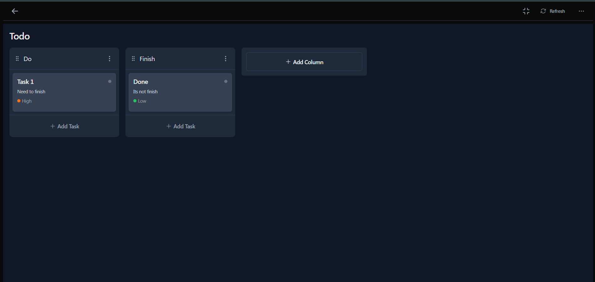

# Allo - Modern Kanban Board Application



Allo is a feature-rich Kanban board application designed to streamline task management and boost team productivity. Built with modern web technologies, it offers a seamless drag-and-drop experience with real-time updates.

## ✨ Key Features

- **Interactive Kanban Boards**
  - Create unlimited boards with customizable columns
  - Intuitive drag-and-drop interface
  - Responsive design works on all devices

- **Advanced Task Management**
  - Rich task details with descriptions, due dates, and attachments
  - Subtasks with progress tracking
  - Priority levels (Low/Medium/High)
  - Color-coded labels for easy categorization

- **Collaboration Tools**
  - Real-time updates (coming soon)
  - Comments and activity logs (coming soon)
  - Board sharing with permissions (coming soon)

- **User Experience**
  - Lightning fast performance
  - Keyboard shortcuts
  - Dark/Light mode toggle

## 🛠️ Tech Stack

### Frontend
- **Framework**: Next.js 14 (App Router)
- **UI**: Tailwind CSS + Headless UI
- **State Management**: React Query
- **Drag-and-Drop**: react-beautiful-dnd
- **Forms**: React Hook Form
- **Icons**: Heroicons

### Backend
- **API**: Next.js API Routes
- **Database**: MongoDB with Mongoose ODM
- **Authentication**: Clerk
- **Validation**: Zod

## 🚀 Getting Started

### Prerequisites
- Node.js 18+
- MongoDB Atlas account or local MongoDB instance
- Clerk account for authentication

### Installation
```bash
# Clone the repository
git clone https://github.com/maro14/allo.git
cd allo

# Install dependencies
npm install

# Set up environment variables
cp .env.example .env.local
```

Configure your `.env.local` with:
```
MONGODB_URI=your_mongodb_connection_string
NEXT_PUBLIC_CLERK_PUBLISHABLE_KEY=your_clerk_key
CLERK_SECRET_KEY=your_clerk_secret
NEXTAUTH_SECRET=your_nextauth_secret
```

## 🛤️ Roadmap

- **Q4 2023**
  - Implement real-time updates for boards and tasks
  - Add comments and activity logs for enhanced collaboration
  - Introduce board sharing with customizable permissions

- **Q1 2024**
  - Integrate with third-party services (e.g., Slack, Google Calendar)
  - Enhance mobile responsiveness and offline capabilities
  - Improve accessibility features

- **Q2 2024**
  - Launch a public API for third-party integrations
  - Add advanced analytics and reporting tools
  - Implement AI-driven task suggestions and prioritization

### Running the App
```bash
# Development server
npm run dev

# Production build
npm run build
npm start
```

Visit `http://localhost:3000` to access the application.

## 📂 Project Structure

```
src/
├── app/                  # Next.js app router
├── components/           # Reusable UI components
├── lib/                  # Utilities and helpers
├── models/               # Database models
├── public/               # Static assets
├── styles/               # Global styles
└── types/                # TypeScript definitions
```

## 🤝 Contributing

We welcome contributions! Please follow these steps:

1. Fork the repository
2. Create your feature branch (`git checkout -b feature/amazing-feature`)
3. Commit your changes (`git commit -m 'Add some amazing feature'`)
4. Push to the branch (`git push origin feature/amazing-feature`)
5. Open a Pull Request

## 📄 License

This project is licensed under the MIT License - see the [LICENSE](LICENSE) file for details.

## 🙏 Acknowledgments
- Inspired by Trello and Notion
- Built with the amazing Next.js ecosystem
